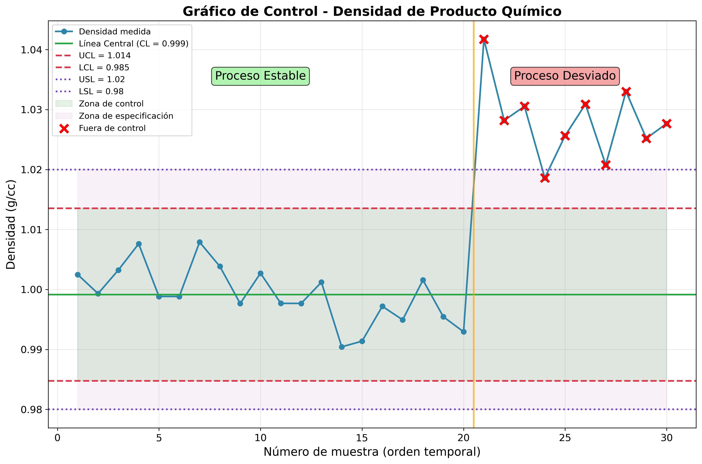
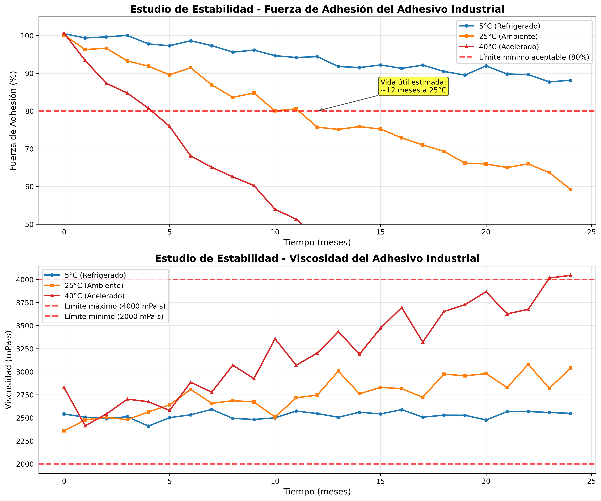
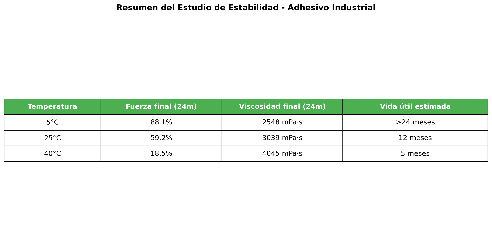
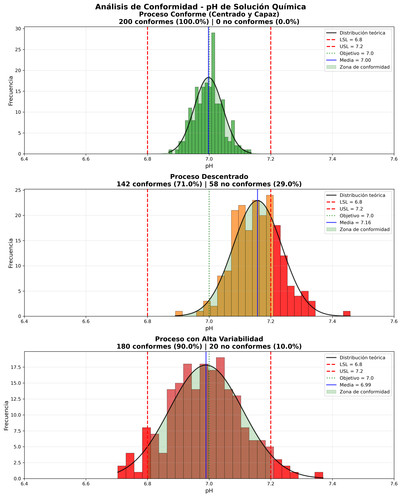
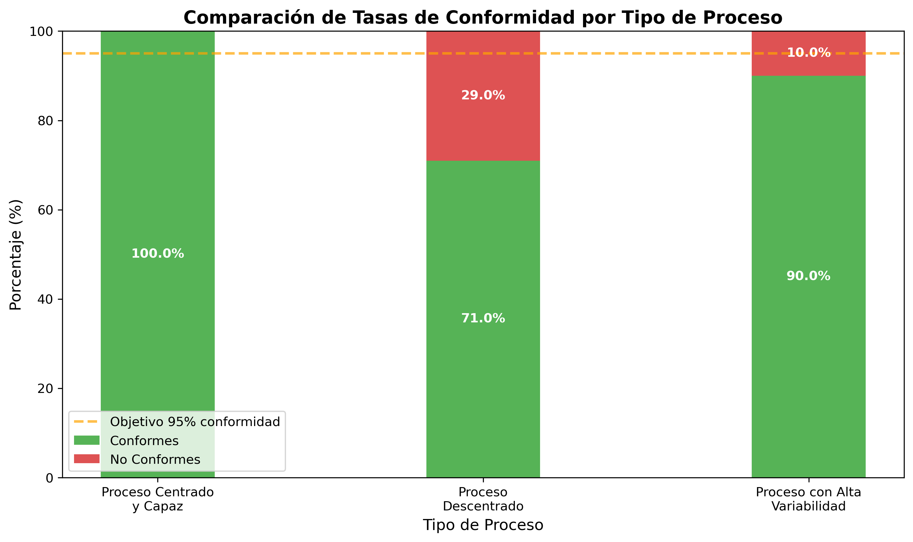
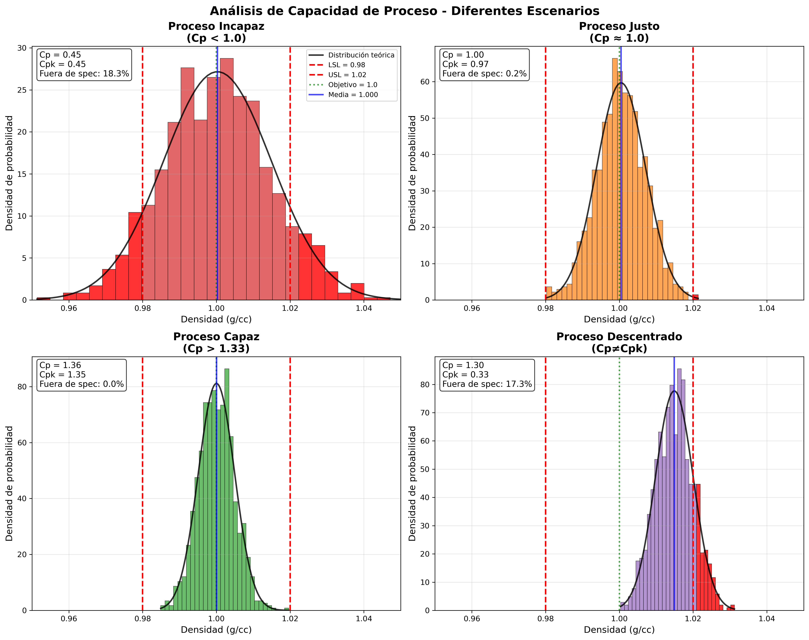
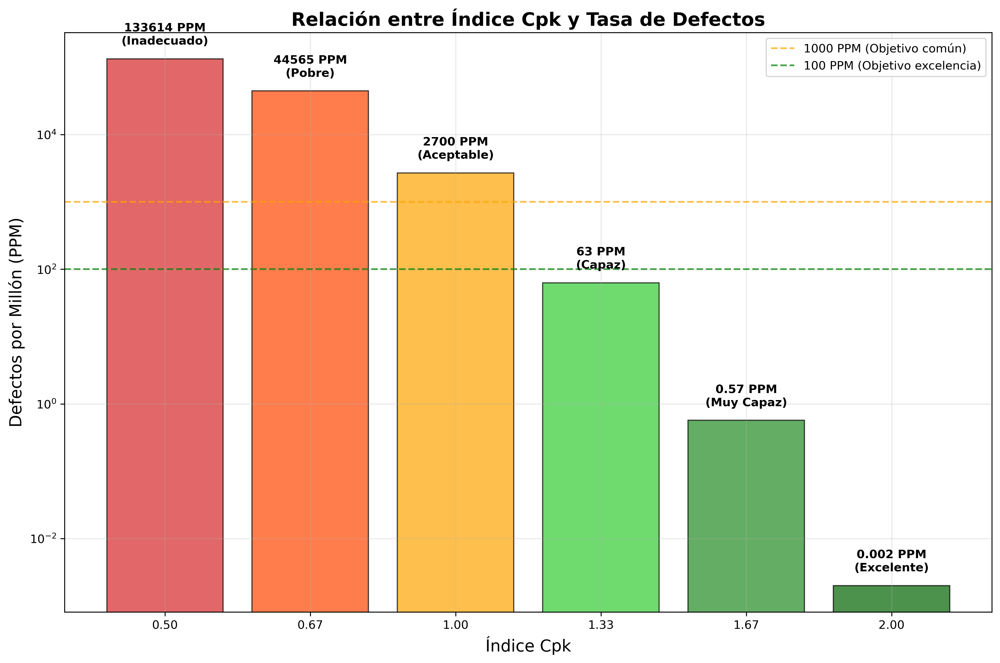
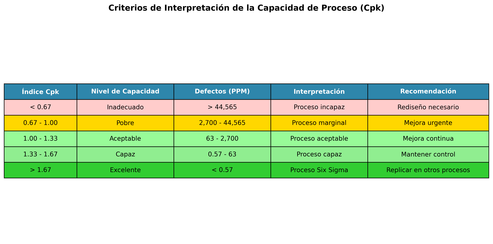
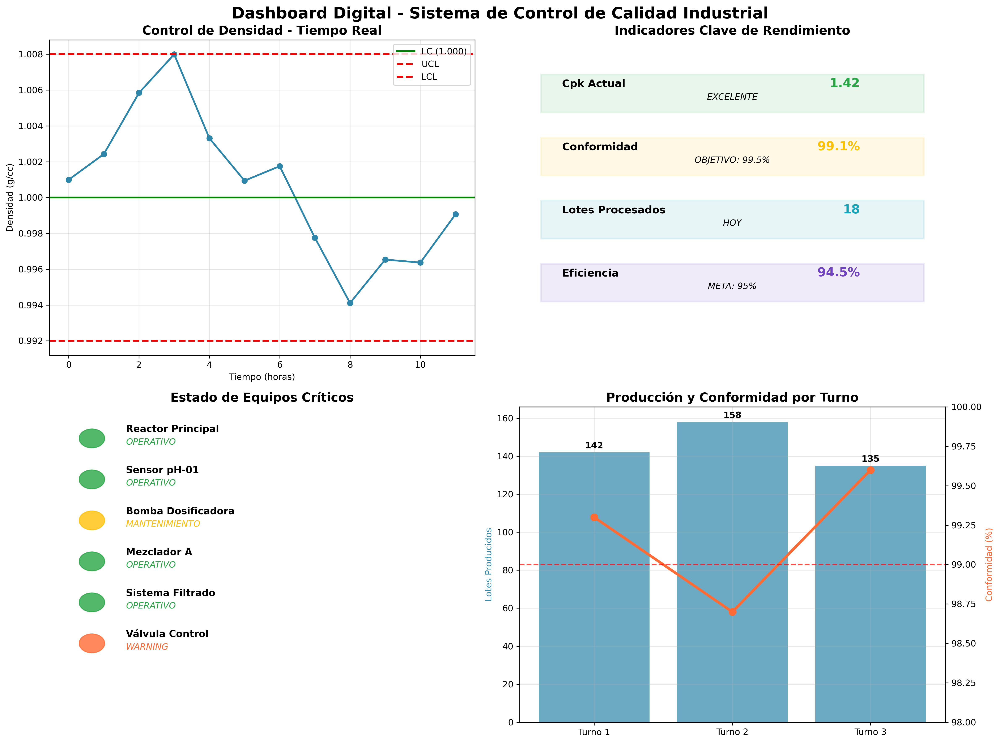

# Guía de Digitalización y Control de Calidad en la Industria Química

## Introducción

Este documento ofrece una visión práctica y estructurada de los conceptos fundamentales del control de calidad en la industria química y cómo la digitalización los potencia. Está diseñado para ser más directo que un informe completo, pero más detallado que una presentación, sirviendo como material de consulta ágil.

Se abordan los siguientes pilares:

*   **Gráficos de Control:** Para la vigilancia y monitoreo de procesos.
*   **Estudios de Estabilidad:** Para asegurar la calidad del producto en el tiempo y la predictibilidad del proceso.
*   **Conformidad:** Para garantizar que los productos cumplen con los requisitos y especificaciones.
*   **Capacidad de Proceso:** Para evaluar cuantitativamente la aptitud de un proceso para cumplir dichas especificaciones.
*   **Herramientas Digitales:** Tecnologías de la Industria 4.0 que automatizan y mejoran el control de calidad.

---

## 1. Gráficos de Control: Monitoreo Estadístico de Procesos

Son la herramienta principal para supervisar la estabilidad de un proceso a lo largo del tiempo.

*   **¿Qué son?** Una gráfica que muestra los datos de una característica de calidad en orden cronológico, comparándolos contra límites estadísticos.
*   **Componentes Clave:**
    *   **Línea Central (LC):** El promedio histórico del proceso. Representa el rendimiento esperado.
    *   **Límites de Control (LCS y LCI):** Bandas calculadas estadísticamente (usualmente a ±3σ de la media) que marcan el rango de la variación **natural** o **común** del proceso.
*   **Finalidad:** Distinguir entre dos tipos de variación:
    *   **Causas Comunes:** El "ruido" aleatorio e inherente de un proceso que está bajo control. Es una variación predecible.
    *   **Causas Especiales:** Factores externos o eventos anómalos (ej. un lote de materia prima defectuoso, un fallo en un equipo) que causan una variación impredecible y desestabilizan el proceso.
*   **Interpretación:**
    *   **Proceso Estable:** Los puntos fluctúan aleatoriamente alrededor de la línea central, dentro de los límites de control.
    *   **Proceso Fuera de Control:** Se detecta por puntos fuera de los límites o por patrones no aleatorios (tendencias, ciclos, etc.). Esto es una señal para actuar.

*Figura 1: Gráfico de control de la densidad de un producto químico simulado, mostrando la línea central del proceso (verde), límites de control (líneas rojas punteadas) y límites de especificación del producto (líneas púrpura punteadas). En la parte inicial (izquierda) el proceso está estable y centrado. Hacia la muestra 21 en adelante, se observa una deriva al alza que indica una pérdida de estabilidad.*

---

## 2. Estudios de Estabilidad: Calidad en el Tiempo

La estabilidad es un concepto dual: se refiere tanto a la **predictibilidad del proceso** como a la **durabilidad del producto**.

### Estabilidad del Proceso

*   **Definición:** Un proceso es estable si su salida es predecible en el tiempo, mostrando únicamente variaciones por causas comunes. Es la base para cualquier análisis de calidad.
*   **Evaluación:** Se utiliza un gráfico de control. Si el proceso está bajo control estadístico, es estable.
*   **Importancia:** Solo tiene sentido analizar la capacidad de un proceso (ver sección 4) si primero se ha demostrado que es estable. Intentar mejorar un proceso inestable es como intentar dar en un blanco en movimiento.

### Estabilidad del Producto

*   **Definición:** Estudios experimentales para determinar la **vida útil** de un producto, evaluando cómo sus propiedades cambian con el tiempo bajo diferentes condiciones (temperatura, humedad, luz).
*   **Objetivo:** Garantizar que el producto mantiene su calidad y seguridad hasta su fecha de caducidad.
*   **Metodología:**
    1.  Almacenar muestras en condiciones controladas (ej. refrigerado, ambiente, acelerado a 40°C).
    2.  Medir periódicamente propiedades clave (viscosidad, concentración, etc.).
    3.  Analizar los datos para determinar el tiempo que tarda el producto en degradarse por debajo de la especificación.
*   **Digitalización:** Cámaras de estabilidad con sensores y LIMS (Sistema de Gestión de Información de Laboratorio) automatizan el registro de datos y el análisis de tendencias.

*Figura 2: Estudio de estabilidad de un adhesivo. Las altas temperaturas (40°C, rojo) aceleran la degradación (cae la fuerza, aumenta la viscosidad), mientras que la refrigeración (5°C, azul) preserva las propiedades.*

*Figura 3: Resumen de resultados del estudio para definir la vida útil y las condiciones de almacenamiento recomendadas.*

---

## 3. Conformidad: Cumplimiento de Especificaciones

La conformidad es la evaluación de si un producto cumple con los requisitos preestablecidos.

*   **Definición:** Grado en que un producto o servicio se ajusta a sus **especificaciones**. Es un veredicto de "pasa" o "no pasa".
*   **Límites de Especificación (LSL y USL):**
    *   Definen el rango de valores aceptables para una característica del producto.
    *   Representan la **"voz del cliente"** o los requisitos normativos.
    *   Son fijos y no dependen del rendimiento del proceso.
*   **Diferencia Crucial: Límites de Control vs. Límites de Especificación:**
    *   **Límites de Control:** Se calculan a partir de los datos del proceso. Indican lo que el proceso **es capaz de hacer** (la "voz del proceso").
    *   **Límites de Especificación:** Son un requisito externo. Indican lo que el proceso **debe hacer**.
*   **Análisis:** Se puede evaluar visualmente con un histograma, donde se comparan la distribución de los datos del proceso con los límites de especificación.

*Figura 4: Análisis de conformidad del pH. El proceso superior es centrado y capaz (alta conformidad). El del medio está descentrado y el inferior tiene demasiada variabilidad, ambos resultando en productos no conformes (barras rojas).*

*Figura 5: Comparación de las tasas de conformidad. Un proceso centrado y con baja variabilidad logra un cumplimiento cercano al 100%, mientras que los otros fallan en alcanzar el objetivo (línea naranja).*

---

## 4. Capacidad de Proceso: ¿Qué tan bueno es nuestro proceso?

La capacidad de proceso va más allá de la conformidad y cuantifica **qué tan bien** un proceso estable puede cumplir las especificaciones.

*   **Definición:** Mide la relación entre la variación natural del proceso y el ancho de la especificación. Solo debe calcularse para **procesos estables**.
*   **Índices Clave:**
    *   **Cp (Capacidad Potencial):** `Cp = (USL - LSL) / 6σ`. Compara el rango de especificación con la dispersión del proceso. **No considera si el proceso está centrado.**
    *   **Cpk (Capacidad Real):** `Cpk = min[ (USL - µ) / 3σ, (µ - LSL) / 3σ ]`. Es el indicador más importante porque **penaliza al proceso si no está centrado**. `Cpk ≤ Cp`.
*   **Interpretación del Cpk:**
    *   `Cpk < 1.0`: Proceso **no capaz**. Produce no conformidades.
    *   `1.0 ≤ Cpk < 1.33`: Proceso **marginalmente capaz**. Requiere control estricto.
    *   `Cpk ≥ 1.33`: Proceso **capaz**. Es un objetivo industrial común.
    *   `Cpk ≥ 1.67`: Proceso de **clase mundial** (calidad Seis Sigma).

*Figura 6: El análisis de capacidad. Arriba-izquierda: incapaz por alta variabilidad. Abajo-derecha: Cp alto pero Cpk bajo por estar descentrado.*

*Figura 7: A medida que el Cpk aumenta, la tasa de defectos (PPM) disminuye exponencialmente.*

*Figura 8: Tabla de criterios para interpretar el índice Cpk, asociando su valor a un nivel de calidad y a acciones recomendadas.*

---

## 5. Digitalización de la Calidad en la Industria 4.0

La tecnología digital integra y automatiza estos conceptos, pasando de un control reactivo a uno proactivo.

*   **Sensores Inteligentes y IoT:** Capturan datos de proceso (pH, densidad, temperatura) en **tiempo real** y los envían a sistemas centrales para su análisis.
*   **PLC y SCADA:** Automatizan las acciones de control (ej. ajustar una válvula) y presentan la información en **dashboards visuales** para los operadores, mostrando gráficos de control y alarmas al instante.
*   **Software de SPC:** Plataformas que automatizan la generación de gráficos, el cálculo de Cpk y la emisión de reportes, facilitando el seguimiento del rendimiento de la calidad.
*   **Inteligencia Artificial (IA):**
    *   **Calidad Predictiva:** Algoritmos que analizan datos para anticipar desviaciones de calidad antes de que ocurran.
    *   **Análisis de Causa Raíz:** Ayuda a identificar las causas subyacentes de la inestabilidad o la baja capacidad.

*Figura 9: Un dashboard digital integra KPIs, gráficos de control en vivo y métricas de producción, permitiendo una gestión de la calidad basada en datos en tiempo real.*

---

## Conclusión Final

La integración de estos cuatro pilares a través de herramientas digitales permite una gestión de la calidad robusta y eficiente. El flujo lógico es el siguiente:

1.  **Usar Gráficos de Control para lograr la Estabilidad del Proceso.**
2.  **Una vez estable, analizar la Conformidad y medir la Capacidad (Cpk) para ver si cumplimos los requisitos.**
3.  **Si la capacidad es insuficiente, usar los datos para mejorar (reducir variación o centrar el proceso).**
4.  **Apalancarse en la digitalización para automatizar y optimizar todo el ciclo.**

Este enfoque sistemático, potenciado por la tecnología, es clave para la competitividad en la industria química moderna. 